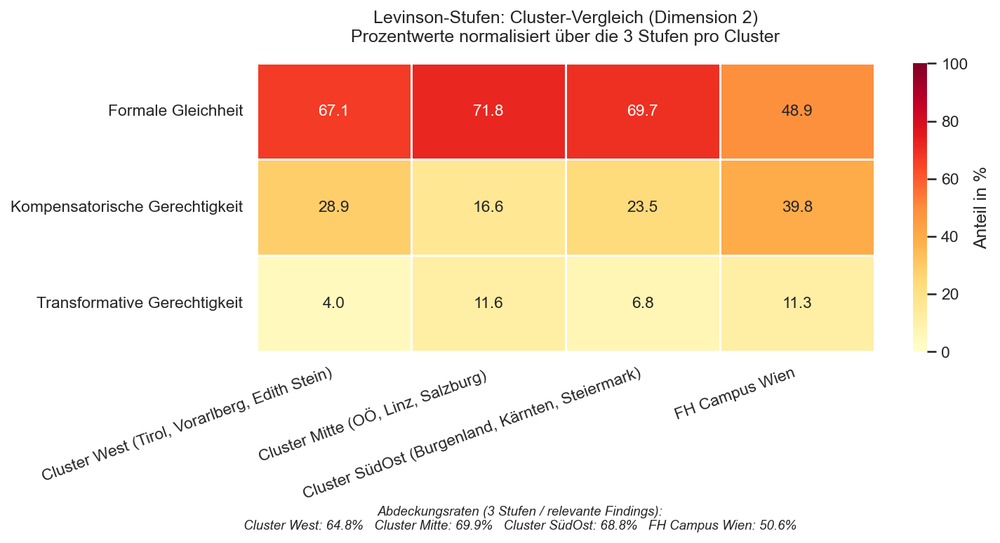
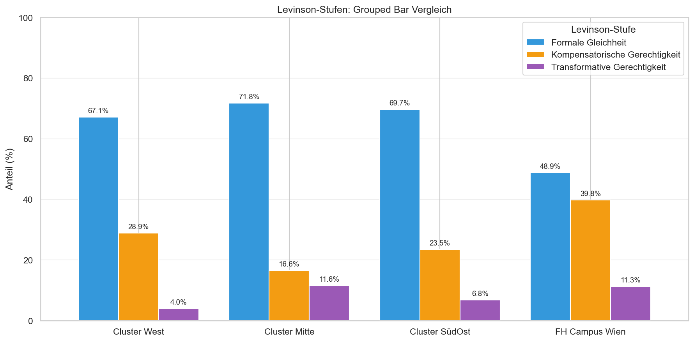

# TRACE-Equity: Levinson-Mapping — Cross-Cluster-Vergleich

**Analysedatum:** 14.04.2026
**Datenbasis:** 1061 relevante Findings aus 4 Clustern
**Forschungsfrage D2:** Welches Gerechtigkeitsverständnis dominiert in den
Curricula — formale Gleichheit, kompensatorische oder transformative Gerechtigkeit?

---

## Konzeptuelle Einordnung

Diese Analyse fokussiert auf die **3 Levinson-Stufen** (Formale Gleichheit,
Kompensatorische Gerechtigkeit, Transformative Gerechtigkeit). Orthogonale
Kategorien (Querschnitt-Codes 2.5/2.7, Explizite Nennung 1.1) werden
transparent ausgewiesen, aber nicht in die Hauptauswertung einbezogen.
Prozentwerte sind jeweils normalisiert über die 3 Stufen pro Cluster.

---

## 1. Hauptauswertung: Prozentuale Verteilung (über 3 Stufen)

| Cluster | Formale Gleichheit | Kompensatorische Gerechtigkeit | Transformative Gerechtigkeit |
|---|---:|---:|---:|
| Cluster West | 67.1% | 28.9% | 4.0% |
| Cluster Mitte | 71.8% | 16.6% | 11.6% |
| Cluster SüdOst | 69.7% | 23.5% | 6.8% |
| FH Campus Wien | 48.9% | 39.8% | 11.3% |

---

## 2. Absolute Zahlen (3 Levinson-Stufen)

| Cluster | Formale Gleichheit | Kompensatorische Gerechtigkeit | Transformative Gerechtigkeit | Summe |
|---|---:|---:|---:|---:|
| Cluster West | 151 | 65 | 9 | 225 |
| Cluster Mitte | 130 | 30 | 21 | 181 |
| Cluster SüdOst | 92 | 31 | 9 | 132 |
| FH Campus Wien | 65 | 53 | 15 | 133 |

---

## 3. Abdeckungsraten

Wie viel Prozent der relevanten Findings fallen in die 3 Levinson-Stufen?

| Cluster | Relevante Findings | In 3 Stufen | Abdeckungsrate | Orthogonal (Querschnitt + Explizit) |
|---|---:|---:|---:|---:|
| Cluster West | 347 | 225 | 64.8% | 122 |
| Cluster Mitte | 259 | 181 | 69.9% | 78 |
| Cluster SüdOst | 192 | 132 | 68.8% | 60 |
| FH Campus Wien | 263 | 133 | 50.6% | 130 |

---

## 4. Kernvisualisierung: Heatmap

*Datei:* `visualisierungen_vergleich/levinson_heatmap.png`

Die Heatmap ist die **Kernvisualisierung** für den Forschungsbericht. Sie
zeigt auf einen Blick, welche Levinson-Stufe in welchem Cluster dominiert.

---

## 5. Ergänzende Visualisierung: Grouped Bar

*Datei:* `visualisierungen_vergleich/levinson_grouped_bar.png`

---

## 6. Interpretation

- **Cluster West (Tirol, Vorarlberg, Edith Stein):** dominant ist *Formale Gleichheit* (67.1%)
- **Cluster Mitte (OÖ, Linz, Salzburg):** dominant ist *Formale Gleichheit* (71.8%)
- **Cluster SüdOst (Burgenland, Kärnten, Steiermark):** dominant ist *Formale Gleichheit* (69.7%)
- **FH Campus Wien:** dominant ist *Formale Gleichheit* (48.9%)

### Befund D2

Über alle 4 Cluster hinweg dominiert die **formale Gleichheit**. Die
curriculare Verankerung bleibt damit überwiegend auf der niedrigsten
Levinson-Stufe: Zugang, Nicht-Diskriminierung und Anerkennung von
Heterogenität stehen im Vordergrund.

**Transformative Gerechtigkeit** — die kritische Hinterfragung von
Machtstrukturen — ist in allen Clustern deutlich unterrepräsentiert
(zwischen 4.0%
und 11.6%).

Die **Cluster-Unterschiede** sind der Gegenstand von Dimension 3
(Schritt 7). Auffällig bereits jetzt: Die Verteilungen variieren
substanziell zwischen den Clustern, was eine systematische Analyse
in Schritt 7 rechtfertigt.

---

**Erstellt mit:** Python (pandas, matplotlib, seaborn)
**Methodik:** Qualitative Content Analysis (QCA) + Levinson-Typologie (2022)
**Mapping-Quelle:** Exposé Tabelle 2 (in Anlehnung an Levinson et al., 2022)
